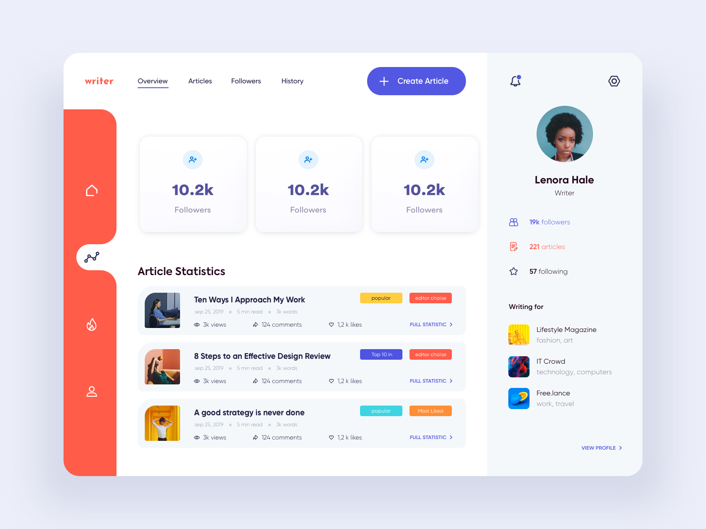
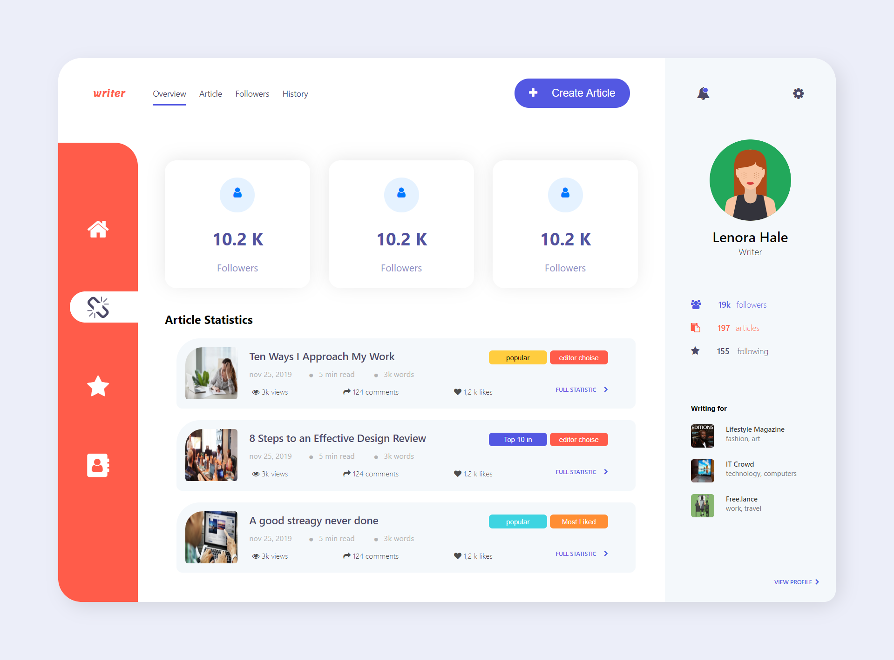

# UI Skill Demo

Here's my UI Skill demo, this project is given me during my placement process.

---

## What I have to achive :) !



## And what I build :O!



---

### What I use during my build-up :

- I use SASS, which is really handy to use instead of normal CSS. It is the pre-compiler for CSS
- FontAwesome, from where i used so many icons
- All the stuff I did is custom CSS,HTML and JS

---

##### Project Tree

```
SquareBoat-project
├─ .git
├─ .gitignore
├─ css
│  ├─ SASS
│  │  ├─ abstract
│  │  │  ├─ _function.scss
│  │  │  ├─ _ids.scss
│  │  │  └─ _variables.scss
│  │  ├─ animations
│  │  │  ├─ _rotation.scss
│  │  │  └─ _shaking.scss
│  │  ├─ base
│  │  │  └─ _base.scss
│  │  ├─ components
│  │  │  ├─ _articleContent.scss
│  │  │  ├─ _mainContent.scss
│  │  │  ├─ _profileClipboard.scss
│  │  │  └─ _verticalNav.scss
│  │  ├─ layout
│  │  │  ├─ _articleContainer.scss
│  │  │  ├─ _mainContainer.scss
│  │  │  ├─ _outerContainer.scss
│  │  │  └─ _sideContainer.scss
│  │  └─ main.scss
│  └─ style.css
├─ favicon.ico
├─ here_mine.png
├─ index.html
├─ package.json
├─ pic.png
├─ README.md
└─ scripts
   ├─ afterLoad.js
   └─ script.js

```
